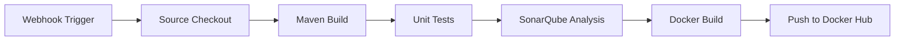
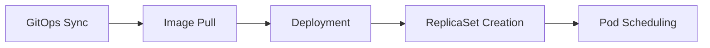

# 🏠 Personal HomeLab - DevOps CI/CD Platform


## 📋 Table of Contents

- [Overview](#overview)
- [Architecture](#architecture)
- [Tech Stack](#tech-stack)
- [Pipeline Flow](#pipeline-flow)
- [Prerequisites](#prerequisites)
- [Installation & Setup](#installation--setup)
- [Usage](#usage)
- [Monitoring & Quality](#monitoring--quality)

## 🎯 Overview

This Personal HomeLab project is a complete **CI/CD platform** built on VMware infrastructure, implementing modern DevOps practices with **GitOps methodology**. The platform automates the entire software delivery lifecycle from code commit to production deployment.

### Key Features

- ✅ **Automated CI/CD Pipeline** with Jenkins
- ✅ **GitOps Deployment** using ArgoCD
- ✅ **Container Orchestration** with Kubernetes
- ✅ **Code Quality Analysis** with SonarQube
- ✅ **Elasticsearch Integration** for log management
- ✅ **Multi-stage Docker Builds** with Maven
- ✅ **High Availability** with Kubernetes ReplicaSets
- ✅ **Private Container Registry** on Docker Hub

## 🏗️ Architecture

```
Developer → GitHub → Jenkins → Maven/Docker → Docker Hub → ArgoCD → Kubernetes Cluster
                ↓                                                  ↓
           SonarQube → Elasticsearch                          Monitoring
```

### Infrastructure Layers

1. **Infrastructure Layer**: VMware vSphere/ESXi
2. **Version Control**: GitHub Repository
3. **CI Layer**: Jenkins + Maven + Docker
4. **Quality Gate**: SonarQube + Elasticsearch
5. **Artifact Storage**: Docker Hub (Private Registry)
6. **CD Layer**: ArgoCD (GitOps)
7. **Runtime**: Kubernetes (EKS/K8s Cluster)

## 🛠️ Tech Stack

### Core Technologies

| Component | Technology | Purpose |
|-----------|-----------|---------|
| **Infrastructure** | VMware vSphere | Virtualization platform |
| **Version Control** | GitHub | Source code management |
| **CI Server** | Jenkins | Continuous Integration |
| **Build Tool** | Maven | Java build automation |
| **Containerization** | Docker | Application packaging |
| **Container Registry** | Docker Hub | Image storage |
| **Orchestration** | Kubernetes | Container orchestration |
| **GitOps** | ArgoCD | Continuous Delivery |
| **Code Quality** | SonarQube | Static code analysis |
| **Search Engine** | Elasticsearch | Log aggregation |
| **DNS** | DuckDNS | External access |

### Additional Tools

- **Jenkins Plugins**: GitHub Integration, Docker Pipeline, Maven Integration
- **Kubernetes Addons**: Ingress Controller, Metrics Server
- **Monitoring**: Prometheus + Grafana (recommended)

## 🔄 Pipeline Flow

### 1. Code Push Stage
```
Developer (Abderrahim06) → Code Push → GitHub Repository
```

### 2. CI Pipeline (Jenkins)



**Steps:**
1. **Webhook Trigger**: GitHub webhook triggers Jenkins pipeline
2. **Build Execution**: Maven compiles and packages the application
3. **Quality Analysis**: SonarQube performs static code analysis
4. **Container Build**: Docker creates container image (10.0.0.31)
5. **Image Push**: Docker image pushed to Docker Hub (10.0.0.32)

### 3. CD Pipeline (ArgoCD)



**Steps:**
1. **GitOps Sync**: ArgoCD monitors Git repository for changes
2. **Image Pull**: Kubernetes pulls image from Docker Hub
3. **Deployment**: ArgoCD applies Kubernetes manifests
4. **Scaling**: ReplicaSets manage pod replicas (Active/Inactive)
5. **Load Balancing**: NAT handles traffic distribution

## 📋 Prerequisites

### Hardware Requirements

- **VMware ESXi Host**: 16GB RAM, 4 vCPU minimum
- **VMs**:
  - Jenkins: 4GB RAM, 2 vCPU
  - Jenkins-agent: 4GB RAM, 2 vCPU
  - SonarQube: 4GB RAM, 2 vCPU
  - Kubernetes Master: 4GB RAM, 2 vCPU
  - Kubernetes Workers: 2GB RAM, 1 vCPU each

### Software Requirements

- VMware vSphere 7.0+
- Ubuntu Server 20.04/22.04 LTS
- Docker 24.0+
- Kubernetes 1.28+
- Jenkins 2.400+
- ArgoCD 2.9+
- SonarQube 9.9+
- Maven 3.8+
- Java 17+

## 🚀 Installation & Setup

### Step 1: Infrastructure Setup

```bash
# Create VMs on VMware
# Assign static IPs:
# - Jenkins: 10.0.0.30
# - Jenkins-agent: 10.0.0.31
# - SonarQube: 10.0.0.32
# - ArgoCD server: 10.0.0.33
# - K8s cluster: 10.0.0.34
```

### Step 2: Jenkins Installation

```bash
# Install Java
sudo apt update
sudo apt install openjdk-17-jdk -y

# Install Jenkins
wget -q -O - https://pkg.jenkins.io/debian/jenkins.io.key | sudo apt-key add -
sudo sh -c 'echo deb http://pkg.jenkins.io/debian-stable binary/ > /etc/apt/sources.list.d/jenkins.list'
sudo apt update
sudo apt install jenkins -y

# Install Docker
curl -fsSL https://get.docker.com -o get-docker.sh
sudo sh get-docker.sh
sudo usermod -aG docker jenkins

# Install Maven
sudo apt install maven -y
```

### Step 3: SonarQube Setup

```bash
# Using Docker Compose
cat > docker-compose.yml <<EOF
version: '3'
services:
  sonarqube:
    image: sonarqube:latest
    ports:
      - "9000:9000"
    environment:
      - sonar.jdbc.url=jdbc:postgresql://db:5432/sonar
    volumes:
      - sonarqube_data:/opt/sonarqube/data
      
  db:
    image: postgres:13
    environment:
      - POSTGRES_USER=sonar
      - POSTGRES_PASSWORD=sonar
    volumes:
      - postgresql_data:/var/lib/postgresql/data

  elasticsearch:
    image: elasticsearch:7.17.0
    ports:
      - "9200:9200"

volumes:
  sonarqube_data:
  postgresql_data:
EOF

docker-compose up -d
```

### Step 4: Kubernetes Cluster

```bash
# Install K3s (Lightweight Kubernetes)
curl -sfL https://get.k3s.io | sh -

# Or use kubeadm for full Kubernetes
sudo kubeadm init --pod-network-cidr=10.244.0.0/16

# Install network plugin
kubectl apply -f https://raw.githubusercontent.com/coreos/flannel/master/Documentation/kube-flannel.yml
```

### Step 5: ArgoCD Installation

```bash
# Create namespace
kubectl create namespace argocd

# Install ArgoCD
kubectl apply -n argocd -f https://raw.githubusercontent.com/argoproj/argo-cd/stable/manifests/install.yaml

# Expose ArgoCD API server
kubectl patch svc argocd-server -n argocd -p '{"spec": {"type": "LoadBalancer"}}'

# Get admin password
kubectl -n argocd get secret argocd-initial-admin-secret -o jsonpath="{.data.password}" | base64 -d
```

### Step 6: Configure Duck DNS

```bash
Visit https://www.duckdns.org/
```

## 📖 Usage

### Triggering a Build

1. **Push code to GitHub**:
```bash
git add .
git commit -m "New feature"
git push origin main
```

2. **Automatic Pipeline Execution**:
   - Jenkins webhook triggers build
   - Maven builds and tests
   - SonarQube analyzes code
   - Docker builds image
   - Image pushed to Docker Hub

3. **GitOps Deployment**:
   - Update Kubernetes manifests in Git
   - ArgoCD syncs changes
   - Rolling update in Kubernetes

### Manual Deployment

```bash
# Sync ArgoCD application
argocd app sync homelab-app

# Check deployment status
kubectl get pods -n production
kubectl get svc -n production
```

### Accessing Services

| Service | URL | Credentials |
|---------|-----|-------------|
| Jenkins | http://10.0.0.30:8080 | admin/admin |
| SonarQube | http://10.0.0.31:9000 | admin/admin |
| ArgoCD | http://10.0.0.32 | admin/[get-password] |
| Application | http://[local-ip] | - |

## 📊 Monitoring & Quality

### SonarQube Dashboard

Monitor:
- Code Coverage
- Code Smells
- Bugs
- Vulnerabilities
- Technical Debt

### Kubernetes Monitoring

```bash
# Check pod status
kubectl get pods --all-namespaces

# View logs
kubectl logs -f deployment/app-deployment

# Check resource usage
kubectl top nodes
kubectl top pods
```

### ArgoCD Dashboard

- Application Health
- Sync Status
- Last Deployment Time
- Git Commit Info

## 👤 Author

**Abderrahim05**

- GitHub: [@Abderrahim05](https://github.com/Abderrahim-DT/)

⭐ **Star this repository if you find it helpful!**